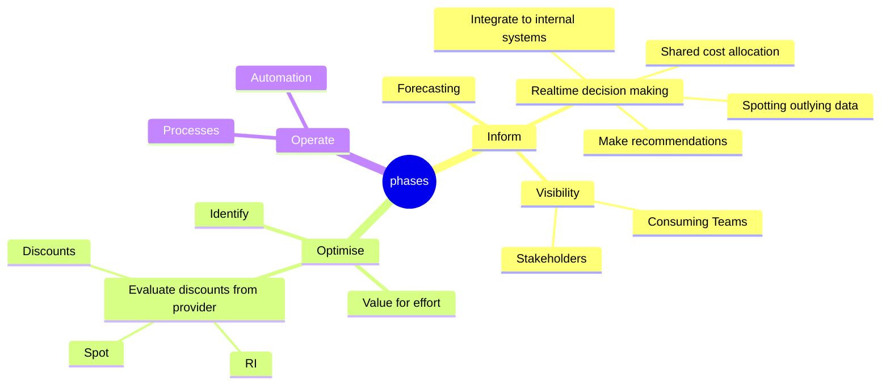
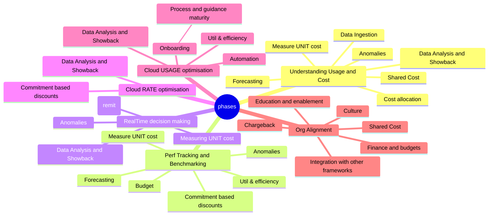

# FinOps-Cheatsheet

## FinOps Lifecycle

## FinOps Domains

https://www.finops.org/framework/domains/

## Terms

Term | Description
---- | -----------
Fully Loaded Costs | 
Showbacks  | 
Chargebacks |
Cloud Unit Economics | Org specific KPI's to measure FinOps success against. Eg. Cost per item/user/gb
