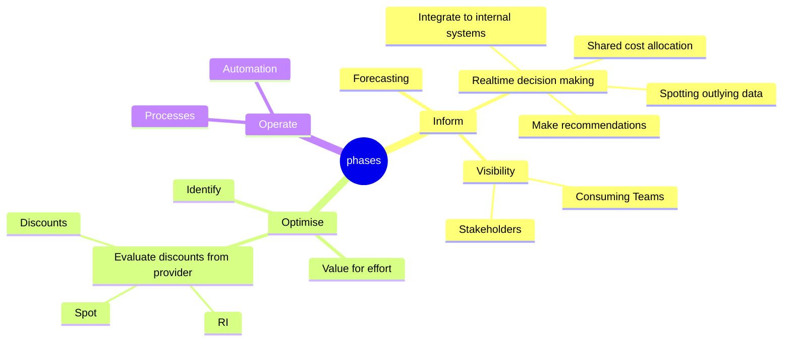

# FinOps-Cheatsheet

## FinOps Lifecycle

```mermaid
mindmap
  root((phases))
    Inform
      Forecasting
      Realtime decision making
        Spotting outlying data
        Integrate to internal systems
        Shared cost allocation
        Make recommendations
        
      Visibility
      ::icon(fa fa-book)
        Consuming Teams
        Stakeholders 

    Optimise
      Identify
      Value for effort
      Evaluate discounts from provider
        RI
        Spot
        Discounts
    Operate
      Processes
      Automation
```

## Terms

Term | Description
---- | -----------
Fully Loaded Costs | 
Showbacks  | 
Chargebacks
